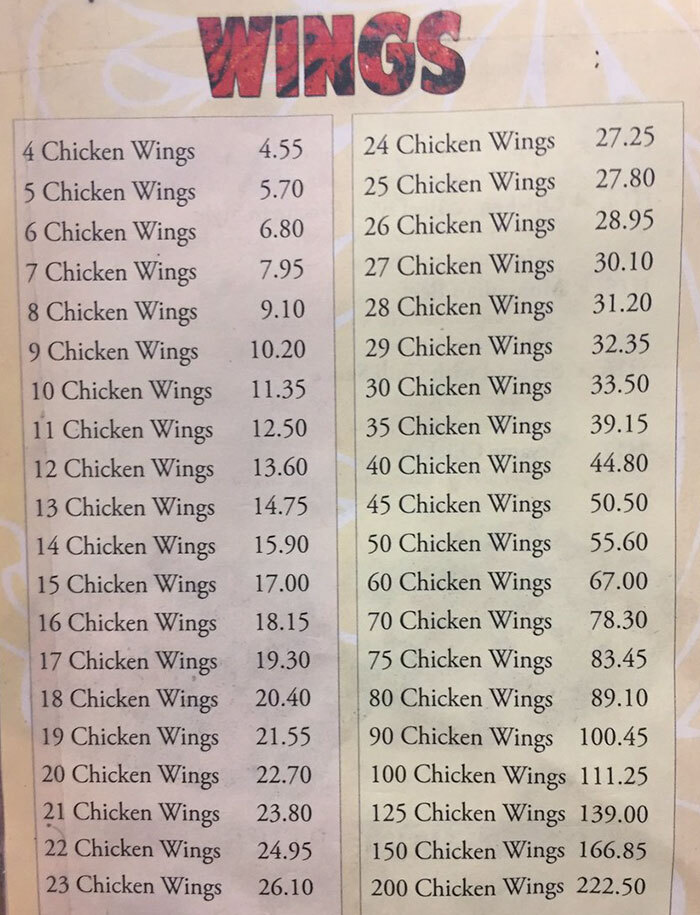

## Background

A bit of 2018 history: A weird obsession emerges surrounding [Danny's Wok chicken wings pricing](https://www.boredpanda.com/chicken-wing-pricing-structure-math-graps-formulas/?utm_source=google&utm_medium=organic&utm_campaign=organic).

Here's the menu that created an uproar: 

```{r}
#| echo: false

```

A few things to notice about this menu:

- It's an image (JPG)
- Non-selectable text
- We want to do some analysis

Our question: How can we get this information into a format that we can more easily work with, without manually entering into a new spreadsheet? 

## OCR: Optical character recognition

Optical character recognition extracts text information from images. 

The [`tesseract` R package](https://cran.r-project.org/web/packages/tesseract/vignettes/intro.html) provides access to [Google's OCR engine](https://opensource.google/projects/tesseract). You can combine it with helpful image processing tools from [`magick`](https://ropensci.r-universe.dev/articles/magick/intro.html). 

### Attach packages: 

```{r}
library(tidyverse)
library(magick)
library(tesseract)
library(here)
```

### Get the image & take a look: 

```{r}
img <- image_read(here("tesseract","chicken-wings.jpg"))

#view in plots window in r studio
image_ggplot(img)
```

## Pre-cleaning & OCR

```{r}
img %>% 
  image_crop(geometry_area(0, 0, 20, 120)) %>% 
  image_ggplot()
```

**Optical character recognition: **

Looks for only numeric characters using the tessaract engine: 

```{r}
# Code below from Tom Mock's example! Thanks Tom! 
num_only <- tesseract(
  options = list(tessedit_char_whitelist = c(".0123456789 "))
  )

prices <- img %>% 
  image_crop(geometry_area(0, 0, 20, 120)) %>% 
  ocr(engine = num_only)
```

## Clean it up

Create a dataframe and wrangle! 

- **String trim**  (`str_trim()`) cuts off excess white space around strings

- **String squish** (`str_squish()`) looks between strings and cuts out the whitespace

```{r}
# Wranglin'
wings_df <- prices %>% 
  str_split(pattern = "\n") %>% 
  data.frame() %>% 
  rename("prices" = 1) %>% 
  mutate(prices = str_squish(prices)) %>% 
  separate(prices, into = c("units_1", "price_1", "units_2", "price_2"), sep = " ") %>% 
  drop_na() %>% 
  mutate_if(is.character, as.numeric)

# Separate into two data frames with matching names
one <- wings_df %>% 
  select(1,2) %>% 
  rename(units = units_1, price = price_1)

two <- wings_df %>% 
  select(3,4) %>% 
  rename(units = units_2, price = price_2)

# Recombine them
full_menu <- rbind(one, two) %>% 
  mutate(price_per_wing = price / units)
```

## Plot the oddness

```{r}
ggplot(data = full_menu) +
  geom_line(aes(x = units, y = price_per_wing)) +
  theme_minimal()
```

## More information / examples

- Tom Mock's [blog post](https://themockup.blog/posts/2021-01-18-reading-tables-from-images-with-magick/)
- [Jeroen Ooms' example](https://www.r-bloggers.com/2017/08/tesseract-and-magick-high-quality-ocr-in-r/) with some pre-processing using `magick`